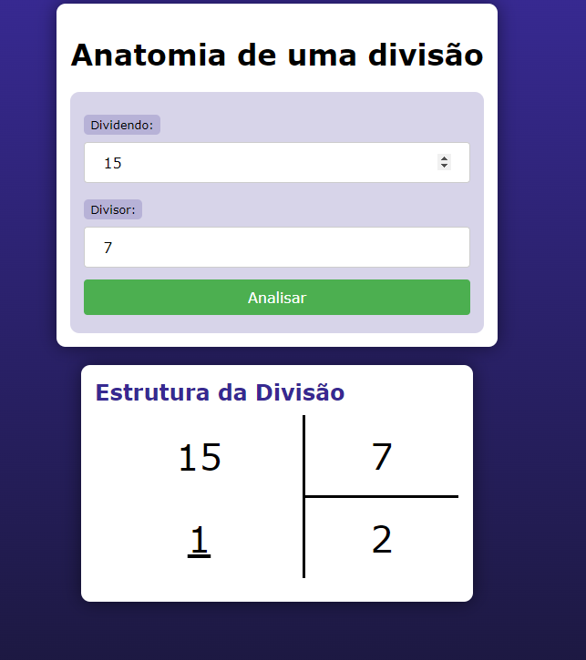

Exercício de PHP: Anatomia de uma Divisão

;
Este projeto em PHP demonstra a estrutura básica para realizar uma divisão entre dois números inseridos através de um formulário HTML. Vamos explorar como o código está estruturado e como ele funciona.

Funcionalidade
O objetivo deste exercício é permitir que o usuário insira dois números (dividendo e divisor) em um formulário HTML e, ao clicar no botão "Analisar", a página exibe o resultado da divisão, mostrando o quociente e o resto da divisão.

Arquivos Incluídos
index.php: Este é o arquivo principal que contém tanto o formulário HTML quanto o código PHP para processar a entrada do usuário e calcular a divisão.
estilo.css: Arquivo CSS utilizado para estilizar a página.
Componentes Principais
Formulário HTML (<form>):

Um formulário simples que permite ao usuário inserir dois números: dividendo e divisor.
Os valores dos campos de entrada são pré-preenchidos com os valores fornecidos pela query string usando <?= $dividendo ?> e <?= $divisor ?>, garantindo que os valores inseridos sejam mantidos se a página for atualizada ou submetida.
Processamento PHP:

O PHP no início do arquivo (<?php ... ?>) verifica se os parâmetros d1 (dividendo) e d2 (divisor) estão presentes na query string ($_GET). Caso não estejam definidos, assume valores padrão de 0 para o dividendo e 1 para o divisor.
Calcula o quociente usando intdiv($dividendo, $divisor) e o resto usando $dividendo % $divisor.
Exibe esses resultados em uma tabela HTML (<table>) dentro da seção específica.
Estilização
O arquivo estilo.css é utilizado para definir estilos visuais adicionais à página. Isso inclui o layout da tabela de divisão (<table class="divisao">), que pode ser personalizado conforme necessário para melhorar a apresentação visual da informação.
Melhorias Potenciais
Validação de Entrada: Implementar validação para garantir que os números inseridos sejam válidos (por exemplo, não permitir divisão por zero).
Mensagens de Erro: Adicionar mensagens de erro para casos em que a entrada do usuário não é válida.
Mais Funcionalidades: Expandir o projeto para incluir outras operações matemáticas ou funcionalidades adicionais, como histórico de operações realizadas.
Conclusão
Este exercício oferece uma introdução simples ao uso de PHP em conjunto com HTML para criar uma aplicação web interativa. Ele demonstra como processar entrada do usuário, realizar cálculos e exibir resultados de forma dinâmica na página.

Por favor, sinta-se à vontade para expandir este projeto e explorar mais recursos do PHP e HTML para personalizar e melhorar a experiência do usuário.
